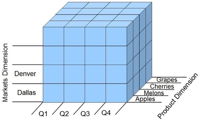

# OLAP et OLTP

## Définitions

### OLTP

OLTP, pour OnLine Transaction Processing, est un modèle utilisé par les Systèmes de Gestion de Base de Données (SGBD) permettant l'insertion, la modification et l'interogation de la base de données. C'est le modèle de base de données le plus courrament utilisé en informatique.

OLTP modèlise les données de manière ralationnelle :
 - Chaque table peut être vue comme un objet
 - Chaque objet peut avoir une où plusieurs relation avec d'autres objets, on dénote 3 types de relations :
   - 1 - 1 : Un objet est lié à un et un seul objet, par exemple un numéro de carte d'identité est lié à une seule personne et cette personne n'as qu'une seule carte d'identité
   - 1 - n : Un objet peut être lié à une ou plusieurs instances d'un autre objets, par exemple l'immatriculation d'une voiture est lié à un seule propriétaire mais ce propriétaire peut avoir plusieurs voitures
   - n - n : Plusieurs instances d'une objet peuvent être lié à plusieurs instances d'objets d'un autre type, par exemple un utilisateur peut avoir plusieurs droit d'accès sur un ordinateur (utilisateur, administrateurs, ...), mais ces droits peuvent également être attribués à plusieurs utilisateurs

### OLAP

> OLAP, pour OnLine Analytical Processing est une technologie permettant d’effectuer des analyses de données multidimensionnelles au sein de bases de données créées à cet effet.  
> Source : [lebigdata.fr - OLAP : définition d’une technologie d’analyse multidimensionnelle](https://www.lebigdata.fr/olap-online-analytical-processing)

Autrement dit, OLAP est une approche du traitement de donnée utilisée avec une base de données multidimmensionnelle, permettant l'extraction et l'analyse de ces données avec plusieurs axes. Les bases de données multidimensionnelles sont également appelées cubes OLAP, dans lesquels chaque attribut (chaque colonne) d'une donnée est vu comme une dimension.

Ce type de base de données est très utilisés dans l'informatique décisionnelle.

## Comparaison

Les bases de données OLTP sont adaptées à un traitement rapide des requêtes simples, par exemple le nombre vente par produit. Ces base de données utilisent le langage SQL. Les bases OLTP sont adaptées au traitement (insertion, suppression, mise à jour) en temps réel et sécurisé des données cependant, ce modèle connaît des limites lorsque l'on souhaite analyser les données :
 - Requêtes de plus en plus complexe ne serais-ce que pour ajouter une dimension
 - Pas d'historisation des données

Exemple de base de données OLTP :

  
Source : [ITProToday : Many-to-Many Relationships in the Data Warehouse](https://www.itprotoday.com/sql-server/many-many-relationships-data-warehouse)

Les bases données OLAP quant à elles sont utilisées pour répondre à des requêtes plus complexes, comme par exemple le nombre de vente, par produit, par personne et par période, et ne sont utilisées qu'en lecture. L'objectif est regrouper, trier, filtrer des données provenants de sources multiple et de les organiser afin de donner à l'utilisateur une vue orientée métier.
Ces bases de données utilisent le langage MDX.

Représentation d'un cube OLAP :

  
Source : [Vox ISM Wordpress : What is the difference between a data warehouse and OLAP cube ?](https://voxism.wordpress.com/2014/04/03/what-is-the-difference-between-a-data-warehouse-and-olap-cube/)

Contrairement aux bases OLTP, les bases OLAP conservent un historique des données, elle ont donc une taille mémoire nettement supérieure. Les bases de données OLAP travaillent également sur un plus grand nombre de données que les bases OLTP. Afin d'améliorer les performance, chaque combinaison possible des dimensions est pré-calculé pour accélérer le traitements des futures requêtes OLAP.

Les bases de données OLAP s'appuient sur les données prevenant des bases OLTP, cependant, ceux-ci sont généralement physiquement séparés car les systèmes acceuillant les bases OLTP, que l'on appelera système de production, ne sont pas prévu pour. Par exemple, la conservation d'un historique de l'inventaire d'un marchand en ligne n'est utile que pour le marchand lui-même, pas pour le client qui souhaite savoir si un produit est actuelement en stock. De même, les requêtes OLAP ralentirait le système de production, nuisant à l'activité dû marchand.

Les modèle OLAP et OLTP ne servent pas le même but, mais il est nécessaire d'avoir une base de données OLTP afin d'utiliser l'OLAP.