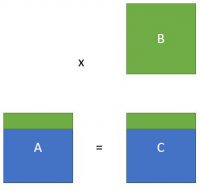

[# Exo 3

## Question 1.1

Oui, car il n'y a pas de dépendances entres les threads concernant cette boucle

## Question 1.2

Oui, mais en indiquant i comme privée dans la zone parallèle

## Examples

```
for i // parallelisable
    for k //oui mais critical nécessaire sur Cij =>  inefficace
        // critical nécessaire car i et j pour
        // être de même valeur (écriture concurrente) 
        for j -> oui
            Cij += Aik * Bkj
```

Faire benchmark 4096*4096 pour parallèlisation sur i](# Parallèlisation avec OpenMP

Ce TP porte sur la parallèlisation CPU du produit de deux matrices A et B vers une matrice résultat C avec OpenMP. La parallèlisation de deux implémentations seront comparées :
- Implémentation manuelle
- Utilisation de BLAS mis à disposition dans la bibliothèque OpenBLAS 

La constante SIZE dans les exemples d'algorithmes désigne la taille des matrice.

## Implémentation manuelle
L'implémentation proposée prend cette forme:
```
for (0 <= i < SIZE)
  for (0 <= j < SIZE)
    for(0 <= k < SIZE)
      // Utilisation d'un accumulateur
      C(i,j) += A(i,k) * B(k,j)
```

### Analyse de l'agorithme

La parallèlisation de ces trois boucles est possible cependant la parallèlisation de la boucle la plus externe est la plus performante:
- La boucle i, la plus externe, 

## Prallèlisation d'appels BLAS

L'implémentation proposée au départ est un simple appels à la fonction cblas_dgemm de la bibliothèque BLAS. Cette fonction prend plusieurs paramètres, notamment:
- la méthode de stockage en mémoire (RowMajor, où ColumnMajor)
- les tailles des matrices
- un pointeur vers la case d'index (0,0) pour chacunes des matrices A,B,C

Ici, la parallèlisation se fait en jouant sur ces paramètres: on "coupe" les matrices en plusieurs morceaux, permettant de faire plusieurs appels à la fonction cblas_dgemm, chacun indépendant des autres:
1. On peut donner une partie de chaque matrice, à condition de bien les faires correspondres
2. Les matrices A et B sont seulement accédées en lecture
3. La matrices C est accédée en écriture, mais comme expliqué dans le point 1., chaque thread écrit dans une partie de C qui est propre à ce thread

En C et C++ La méthode de stockage utilisée naturellement est RowMajor, méthode que nous utiliserons pour chacuns de ces appels, ceci impliquant que chaque thread multipliera une partie de A avec la matrice B:
  
En vert, la partie utilisée par un thread.

Le nombre de colonnes des matrices A et C est calculée fonction du nombre de threads totaux, du numéro du thread actuel et de la taille des matrices.

## Comparaison et analyse des performances

**INSERER JOLI GRAPHIQUE ICI**

# blabla

ceci lorem ipsu eifvgihjeyg

czuiehfiuzehf  
jzeifghbez

# Auteurs
DJEBRI Maroua  
BROSSARD Florian


# Rapport du TP OPENMP
## Parallélisme, systèmes distribués et grille
## M2 ILC

1)parallélisation des deux variantes du kernel 0: 


A travers le TP de produit de matrices sur une machine multi-coeurs en utilisant "OpenMP", on a essayé de régler  le probléme de parallélisation du produit matricielle.


On  a rencontrer des cas de figures différents:

    Parties de code parallélisable car il est sequentiel et le résultat de son exécution par un thread ne dépend pas des             résultats calculés par     les autres               threads, on peut prendre comme exemple : 
    
        La boucle externe du kernel 0 où les itérations sont indépendantes, alors il fallait juste ajouter un #pragma omp                 parallel for private"(i,j,k)" afin de rendre toute la région parallel et  prévatiser les variables (i,j,k), afin que ces         variable évoluent de façon indépendante.
            Quelques résultats :

             | Threads | Texec | Gflops |ExecBoucle|
            | --- | -------- | -------- |-------- |
            | 2   | 0.36    | 6.5    |0.31    | 
            | 5   | 0.19   | 14.43   |0.14   | 


         La boucle du milieu où c’est possible de paralléliser, car le code est séquentielle et ses itérations sont indépendantes          où il fallait  privatiser  le "i" dans toute la région parallèle pour qu'il soit partagé et disponible  pour tous les            threads.
         
        la privatisation des ” j, k” sont également importante pour qu'ils évoluent indépendamment.
        Quelques exemple:
        
            | Threads | Texec | Gflops |ExecBoucle|
            | --- | -------- | -------- |-------- |
            | 2   | 0.36    | 6.46    |0.33    | 
            | 5   | 0.23    | 10.83   |0.19   | 

    Parties du code où ce n'est pas sequentiel, on rencontre plus de difficultés mais on arrive à faire la parallélisation 
    en ajoutant "#pragma omp critical" afin d'empêcher les threads d'accéder à la zone critique pour lire ou écrire en même 
    temps.Ceci permettera à chaque threads thread d'accéder à la zone critique que aprés avoir attendu que le thread 
    précédents soit sortie de la zone critique.
    On peut prendre comme exemple la boucle interne du Kernel 0 où l'on privatisé la varible "K" pour qu'elle soit indépendante       et on a ajouté le "#pragma omp critical" 

Il faut ajouter un private k pour qu’il soit indépendant.
 
Comme chaque thread calcul un morceau de l’accumulateur, il faut ajouter un + pour que chacun ajoute son morceau.

Diminution de performance
C’est à cause de la zone critique qui est accédé par chaque thread à tour de rôle ce qui rend l’exécution du programme plus lente.

1 thread :
gigaflops :2.29
temps exec global:0.98
temps exec boucle : 0.93
2 thread :
gigaflops :2.017
temps exec global:1.09
temps exec boucle : 1.06
16 thread :
gigaflops :10.83
temps exec global: 11.78
temps exec boucle : 11.75
 
2.1) la boucle la plus performante c’est la boucle ijk
2.2) les performances sont meilleur en 1024 qu’on 4096 car …..
3.2)BLAS
 
Exercice Indépendant :
     FOR I                       	OUI
           FOR K            	critical
                FOR J                  	
                     Cij += aik +bk
 
 
 en prend le B en entier car on découpe le A et le C en ligne  car c’est multiplication de matrice 
cas où le nombre de thread est impair  alors on fait un omp single  pour qu’on permettent à un thread d’accéder et traiter  le reste des tâches.

)